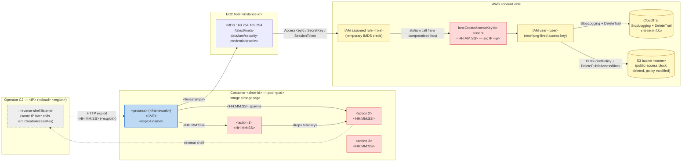

# Reporting templates

Five blocks:
- **Block 0** — the 2-paragraph user-facing summary (what gets printed in the chat at the end of the investigation).
- **Block 1** — the full investigation case in markdown (what gets written to `/tmp/sysdig-runtime-investigate-<event_id>-<UTC-ts>.md` and used as the body of any Jira/PagerDuty handoff).
- **Block 2** — the Jira payload.
- **Block 3** — the PagerDuty Events API v2 payload.
- **Block 4** — the optional HTML wrapper. Same Block 1 content rendered in a self-contained HTML page that displays Mermaid diagrams in the browser. Used when the user picks the HTML output format at the end of Phase 3.

## Output format choice (Phase 3)

Before writing the file, ask the user via `AskUserQuestion`:

> "How do you want the report rendered? `Markdown` (default — plays nice with Jira/PagerDuty handoff) / `HTML` (renders Mermaid diagrams in browser, self-contained) / `Both`."

- `Markdown` → write Block 1 verbatim to `/tmp/sysdig-runtime-investigate-<id>-<ts>.md`. This is the default for any handoff (Jira/PagerDuty body uses this content).
- `HTML` → write the Block 4 wrapper around the same Block 1 content to `/tmp/sysdig-runtime-investigate-<id>-<ts>.html`. Open with `open /tmp/...html` to view in the default browser.
- `Both` → write both files. The summary citation lists both paths.

If `AskUserQuestion` is not available (some agent clients), default to `Markdown` only and mention in the summary that HTML is also available — point the user at the command to regenerate.

## Block 0 — User-facing summary (2 paragraphs, no tables)

This is the only thing the user sees in the chat at the end of the investigation. Keep it tight — the long version lives in the file. Goal: answer "what happened, how confident, what to do next" in two paragraphs.

Template (substitute the placeholders, write in prose, do not use bullets or tables):

```markdown
**Investigation: <aiGeneratedName>** — <MITRE tactic>, confidence <N>/5

<Paragraph 1: what happened, in 2–4 sentences. The single highest-confidence finding plus the investigator's read of the chain. Name the affected resource(s), the trigger, and the most important downstream signal (e.g. "Tomcat → bash → xmrig miner; same hour saw Admin6 access-key creation and CloudTrail tampering on the same AWS account"). Avoid jargon; this is the headline.>

<Paragraph 2: top 2–3 next checks, framed as actions, plus the file path. Example: "Verify whether telnetd is listening (`ss -lntp | grep :23`); rotate ec2-role-<X> credentials; review the lateral pod frontend/frontend. Full case with process tree, IOC tables, and audit trail at `/tmp/sysdig-runtime-investigate-<id>-<ts>.md`.">
```

The summary must mention the file path so the user can read the full case if they want.

## Block 1 — Investigation case (markdown — written to /tmp file)

The case is **narrative**, not a data dump. Render the sections in this order. Every section has a job; if a section has no signal, write a one-sentence "no signal" line rather than skipping the heading entirely — the structure is itself part of the audit trail.

```markdown
## <aiGeneratedName> — <MITRE tactic, e.g. "Discovery (T1082)">

**Event ID:** <event.id> | **Type:** <event.type> | **Status:** <event.status>
**Time:** <startTime> — <lastSignal>

### Summary

<1–2 sentences. Lead with the single highest-confidence finding plus the
investigator's read of what happened. Example: "The host ran a sequence
of system-information-gathering commands consistent with reconnaissance
(T1082); no evidence the listed CVEs were exploited. Confidence the
event is opportunistic recon: 4/5.">

### What happened

- **Trigger:** <rule name(s)>, classified as <MITRE tactic>.
- **Process tree (from `mcp__sysdig__get_event_process_tree`, if available):** render as `parent → child → grandchild` with command-line snippets where useful. Fall back to "no process tree available" if the MCP call returned nothing or wasn't loaded.
- **Process evidence (parsed from threat description):** <e.g. "systemd → sshd → bash → locale (repeated)". Lift this from `aiGeneratedDescription` parsing — keeps the AI's narrative read alongside the structured tree.>
- **Resource:** <cluster/namespace/workload> *(or `host <hostname>` for non-K8s)*.
- **AI-generated rationale:** <1–2 sentences summarising `aiGeneratedDescription`.>

### Attack flow *(render only when the case is multi-stage)*

Render this section as a Mermaid `flowchart LR` followed by a compact timeline table, **only** when at least two of the following hold:

- `case.incident_threat_groups` has ≥ 2 entries (the case spans multiple Threats Engine groups).
- 3+ MITRE tactics fired across the chain (count the trigger + watchlist hits).
- The chain spans at least two domains (K8s + cloud account, host + container, container + cluster API server, etc.).

If none / one of the above holds, omit this section entirely — don't render an empty diagram or placeholder. A linear single-tactic event is best read as the "What happened" bullets, not a graph.

#### Diagram conventions

The goal is a per-action graph, not an entity-relationship graph. Each malicious operation is its own node with a timestamp; each labelled edge is causation or data flow. Boundaries (pods, hosts, AWS accounts, attacker infra) are rendered as Mermaid `subgraph` blocks so the reader sees what crossed which trust boundary.

**Node shape conventions:**

- `[" … "]` rectangle for actions (commands executed, syscalls, API calls). Most nodes are rectangles.
- `["…"]:::entrypoint` rectangle styled blue — the initial-access node (e.g. the Tomcat process exploited via Spring4Shell). At most one per chain.
- `[(" … ")]` cylinder for cloud services and data stores (S3 bucket, CloudTrail, IMDS endpoint).
- `(("…"))` rounded for external actors (operator C2, attacker IPs).

**Subgraph conventions:**

- One subgraph per trust boundary actually involved: each pod / container, each EC2 host, each AWS account, the attacker's external infrastructure. Title each subgraph with the canonical identifier (container ID, hostname, account ID).
- Don't create a subgraph for a boundary that has only one node — inline it.

**Edge labels:**

- Prefix with the action timestamp in `HH:MM:SS` (UTC) when known: `-- "09:12:43 spawns" -->`. Multiple timestamps on the same edge are fine: `"09:13:22, 09:13:30, 09:16:50 (×4)"`.
- Use dotted edges (`-. " " .->`) for inferred / out-of-band relationships (e.g. attacker IP correlation across non-contiguous events).
- Don't write sentences on edges. The label should fit on one line of the rendered SVG.

**Class definitions** (paste at the bottom of every diagram, regardless of which classes are used):

```
classDef entrypoint fill:#bdd9f4,stroke:#1f6feb,stroke-width:2px;
classDef malicious  fill:#ffd8d8,stroke:#cf222e,stroke-width:1px;
classDef cloud      fill:#fff8c5,stroke:#9a6700,stroke-width:1px;
classDef external   fill:#eeeeee,stroke:#57606a,stroke-width:1px,stroke-dasharray:4 2;
```

Apply with `class node1,node2 malicious;` after the edge definitions.

#### Sizing limits

- Soft cap: ~15 action nodes. Hard cap: ~25. Past that, group adjacent steps under a synthetic node (e.g. "discovery sweep — find/curl/uname ×N") rather than rendering each.
- Always cap subgraph titles at ~120 chars; line-wrap long ones with `<br/>`.

#### Skeleton (substitute placeholders; trim/extend branches based on the actual chain)

````markdown

````

#### Timeline (compact)

Below the diagram, render a 3-column markdown table that lists every node from the diagram in chronological order. This gives the reader a linear narrative to read alongside the visual:

```markdown
| Time (UTC) | Where | Action |
|---|---|---|
| `<HH:MM:SS>` | `<container/host/account>` | `<command or rule>` — `<short note>` |
```

Keep it tight: one row per diagram node, in chronological order. Use inline code for command literals and identifiers; leave prose for the note column.

### Resource context

- **Cluster / host metadata:** <e.g. "GCP node in cluster `ai-attack-demo`, region europe-west1">.
- **Sibling workloads on this resource:** <list 3–5 from `mcp__sysdig__run_sysql` siblings query. If empty, "no siblings surfaced".>
- **Prior events on this resource (last 7d):** <count + 1-line rule summary, e.g. "4 prior events: 2× Discovery, 1× Defense Evasion, 1× same rule firing 2 days ago". If empty, "no prior events".>
- **ServiceAccount RBAC** *(K8s workload threats only)*: <one-line summary of bound roles, e.g. "default SA with cluster-wide list/get on Pods + Deployments — explains kubectl-style lateral capability". If skipped, "RBAC not enumerated".>

### Incident scope (cluster activity in window) *(from Phase 2 cluster-wide sweep — render even when empty)*

<One sentence framing: "X cluster-wide events fired in the ±2h window; Y matched the high-signal watchlist." If zero, write "No related cluster activity in the window — single-resource event.">

If watchlist hits exist, render them as a table — they are the strongest signal that the case is part of a larger campaign:

| Time | Source | Rule | Resource | Why it matters |
|------|--------|------|----------|----------------|

If `case.incident_threat_groups` is non-empty (incident-scope detection from Phase 1), prefix the table with: *"This case spans Threats Engine groups: [<group1 name>], [<group2 name>], [<group3 name>] — single incident, unified narrative."*

Cloud-API summary: <if cloudtrail integrated, summarise S3/IAM/IMDS hit counts; otherwise "No CloudTrail integration in this tenant".>

### Vulnerability surface

<resource>:
- **Counts:** <X critical, Y high in-use, Z exploitable, K with fix available>.
- **High-signal CVEs:** <up to 5 — only those that pass the MITRE-tactic gate against the rule, or that are KEV-listed regardless. Each as a one-liner: CVE-id (severity, CVSS, in_use?, exploitable?, KEV?), package.>

If `scan_found: false`, write "No runtime scan data available for this resource".

### Correlation & confidence

<1 sentence summary of what scored ≥4 and why, plus what was deliberately not correlated. Example: "1 finding scored ≥4: CVE-2024-3094 in `liblzma` matches the suspicious `sshd` execution chain. The 4 KEV-listed CVEs on the host did not correlate (tactic mismatch — recon rule vs initial-access exploits) and are listed in Vulnerability surface above for completeness.">

| Rule | Finding | Confidence | Rationale |
|------|---------|------------|-----------|

*(Maximum 3 rows. If fewer, fewer.)*

### Recommended next checks

<3–4 bullets. Factual, not prescriptive. Each is an action that would confirm or refute a hypothesis raised by the case.>

- Example: "Verify whether telnetd is listening on the affected host (`ss -lntp | grep :23`) — if not, CVE-2026-24061 is unreachable from this attack path."
- Example: "Review prior Discovery-tactic events on this host in the last 30 days to determine if this is a one-off or part of a pattern."
- Example: "If the resource is a public-facing GCP node, check VPC firewall rules for telnet (port 23) and SSH (port 22) allow-lists."
```

That is the complete report shape. Sections may be empty (with a "no signal" line) but the structure stays. The previous template's "do not append anything" rule has been intentionally dropped — narrative is the point now.

## Block 2 — Jira payload

Use the detected create-issue tool (e.g. `mcp__atlassian__createJiraIssue`). Required fields:

- `cloudId` — taken from the detected Atlassian site or from `getVisibleJiraProjects`.
- `projectKey` — picked by the user, or carried in env var `SYSDIG_RUNTIME_JIRA_PROJECT` if set.
- `issueTypeName` — `Task` by default. Promote to `Incident` only when (a) there is at least one correlation row at confidence 5, AND (b) that finding's MITRE tactic is in the Initial-Access → Execution → Privilege-Escalation chain. KEV-on-tactic-mismatch alone does not promote.
- `summary` — `[Sysdig Runtime] <aiGeneratedName>` (truncate to 200 chars).
- `description` — markdown body using Block 1 verbatim, plus a footer line `**Audit:** event_id=<event.id> | sources=<list_of_sources_queried>`.
- `labels` — `["sysdig-runtime-investigation", "<mitre_tactic_lowercase_with_dashes>"]`.

Capture the returned `key` and `self` URL and surface them to the user.

## Block 3 — PagerDuty Events API v2 payload

```json
{
  "routing_key": "<from-detected-env-var>",
  "event_action": "trigger",
  "dedup_key": "sysdig-<event.id>",
  "payload": {
    "summary": "[Sysdig Runtime] <aiGeneratedName>",
    "severity": "<critical|error|warning|info>",
    "source": "<cluster>/<namespace>/<workload>",
    "component": "sysdig-runtime-investigate",
    "group": "<MITRE tactic>",
    "class": "<event.type>",
    "custom_details": {
      "case": "<full Block 1 rendered as a string>",
      "event_id": "<event.id>",
      "audit": "event_id=<event.id> | sources=<list_of_sources_queried>"
    }
  }
}
```

Severity mapping (from event severity number — 0 critical … 4 info):

- `0` → `critical`
- `1` → `error`
- `2` → `warning`
- `3` or `4` → `info`

## Block 4 — HTML wrapper (self-contained, renders Mermaid in the browser)

Wrap the same Block 1 markdown content in this HTML page. The page loads `marked` for markdown rendering and `mermaid` for diagram rendering, both from CDN. Open the resulting `.html` file in any browser — no build step.

The agent's job is to produce the markdown content (Block 1 verbatim) and substitute it into the `<script id="md" type="text/markdown">` block below. **Do not pre-render the markdown to HTML yourself** — `marked` does that at page-load time, which keeps the file editable and small.

```html
<!DOCTYPE html>
<html lang="en">
<head>
<meta charset="utf-8">
<title>Sysdig Runtime Investigation — <event_id></title>
<style>
  :root { color-scheme: light dark; }
  body { font-family: -apple-system, BlinkMacSystemFont, "Segoe UI", "Helvetica Neue", sans-serif; max-width: 1200px; margin: 2em auto; padding: 0 1.5em; line-height: 1.55; color: #1f2328; }
  h1, h2, h3, h4 { color: #1f2328; line-height: 1.25; margin-top: 1.6em; }
  h1 { border-bottom: 1px solid #d0d7de; padding-bottom: .3em; }
  h2 { border-bottom: 1px solid #d0d7de; padding-bottom: .3em; }
  code { background: #f6f8fa; padding: 2px 6px; border-radius: 4px; font-family: ui-monospace, SFMono-Regular, "SF Mono", Menlo, monospace; font-size: 0.92em; }
  pre { background: #f6f8fa; padding: 1em; border-radius: 6px; overflow-x: auto; }
  pre code { background: transparent; padding: 0; }
  table { border-collapse: collapse; width: 100%; margin: 1em 0; }
  th, td { border: 1px solid #d0d7de; padding: 6px 12px; text-align: left; vertical-align: top; }
  th { background: #f6f8fa; font-weight: 600; }
  blockquote { border-left: 4px solid #d0d7de; color: #57606a; padding: 0 1em; margin: 1em 0; }
  .mermaid { text-align: center; margin: 1.5em 0; background: #fafbfc; padding: 1em; border-radius: 6px; }
  @media (prefers-color-scheme: dark) {
    body { background: #0d1117; color: #c9d1d9; }
    h1, h2, h3, h4 { color: #c9d1d9; }
    h1, h2 { border-bottom-color: #30363d; }
    code, pre { background: #161b22; }
    th { background: #161b22; }
    th, td { border-color: #30363d; }
    blockquote { border-left-color: #30363d; color: #8b949e; }
    .mermaid { background: #161b22; }
  }
</style>
</head>
<body>
<div id="rendered"></div>

<script id="md" type="text/markdown">
<!-- ⇩ PASTE BLOCK 1 MARKDOWN CONTENT VERBATIM HERE ⇩ -->
<!-- (No HTML escaping needed — the script tag is opaque to the browser parser.) -->
</script>

<script src="https://cdn.jsdelivr.net/npm/marked/marked.min.js"></script>
<script type="module">
  import mermaid from 'https://cdn.jsdelivr.net/npm/mermaid@10/dist/mermaid.esm.min.mjs';

  const src = document.getElementById('md').textContent;
  document.getElementById('rendered').innerHTML = marked.parse(src);

  // Convert ```mermaid``` fenced blocks (rendered by marked as <pre><code class="language-mermaid">)
  // into <div class="mermaid"> so mermaid.run() picks them up.
  document.querySelectorAll('pre code.language-mermaid').forEach((el) => {
    const div = document.createElement('div');
    div.className = 'mermaid';
    div.textContent = el.textContent;
    el.parentElement.replaceWith(div);
  });

  mermaid.initialize({
    startOnLoad: false,
    theme: window.matchMedia('(prefers-color-scheme: dark)').matches ? 'dark' : 'default',
    flowchart: { curve: 'basis', useMaxWidth: true },
  });
  await mermaid.run();
</script>
</body>
</html>
```

**Notes for the agent rendering Block 4:**

- Substitute `<event_id>` in the `<title>` tag with the actual event ID.
- Paste the Block 1 markdown into the `<script id="md">` block verbatim. Markdown inside `<script type="text/markdown">` is opaque to the browser parser, so no escaping is needed for `<`, `>`, `&` etc.
- Do not inline the marked/mermaid libraries; the CDN paths are stable and the page loads instantly. If offline use is required, the user can swap the script srcs for local copies — call this out in the summary if relevant.
- The page works in light and dark mode. Mermaid uses the matching theme.
- Tested with `marked` v9+ and `mermaid` v10+. Both are pinned to major versions so minor bumps don't break it.
